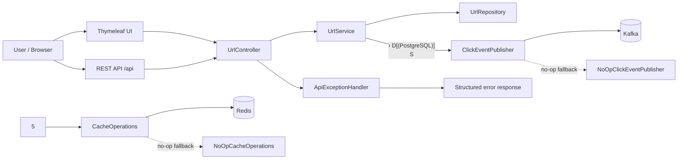
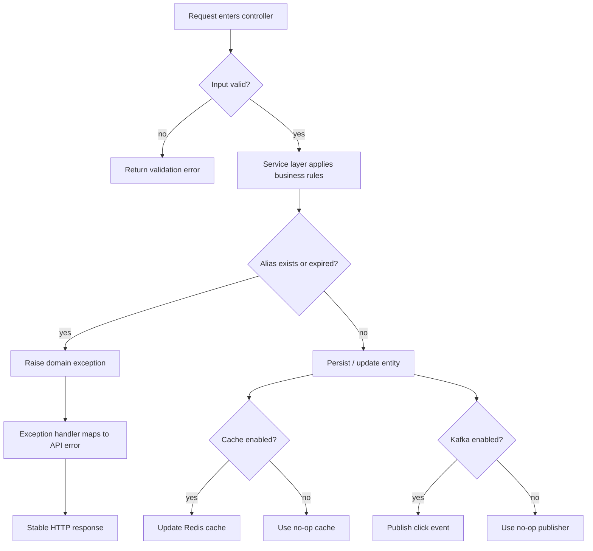
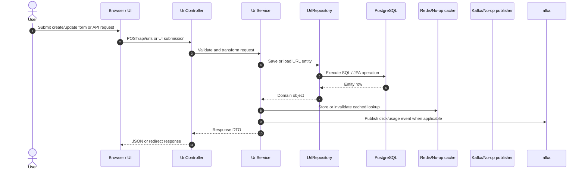
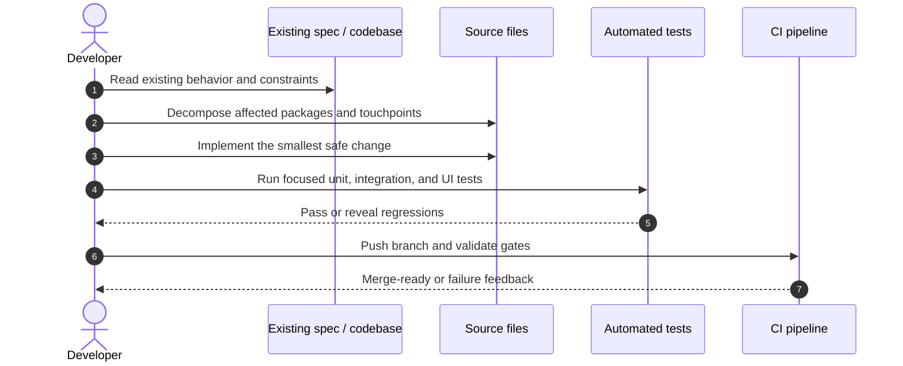
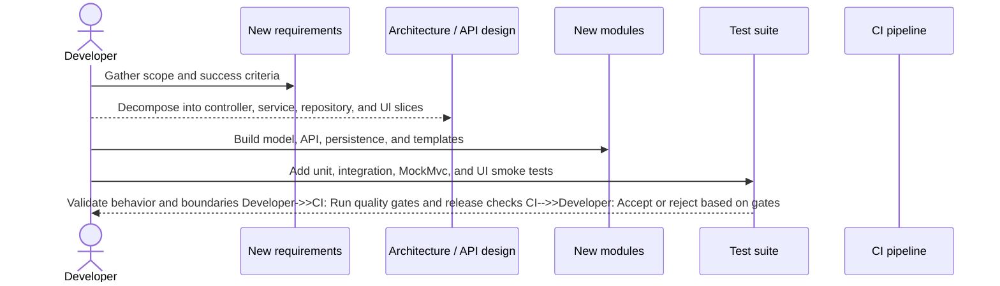
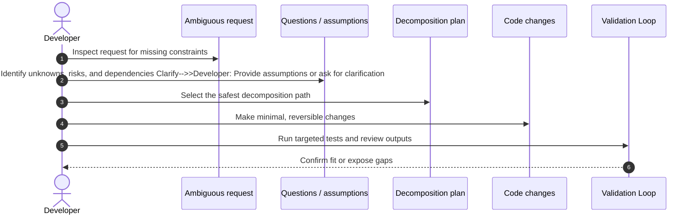
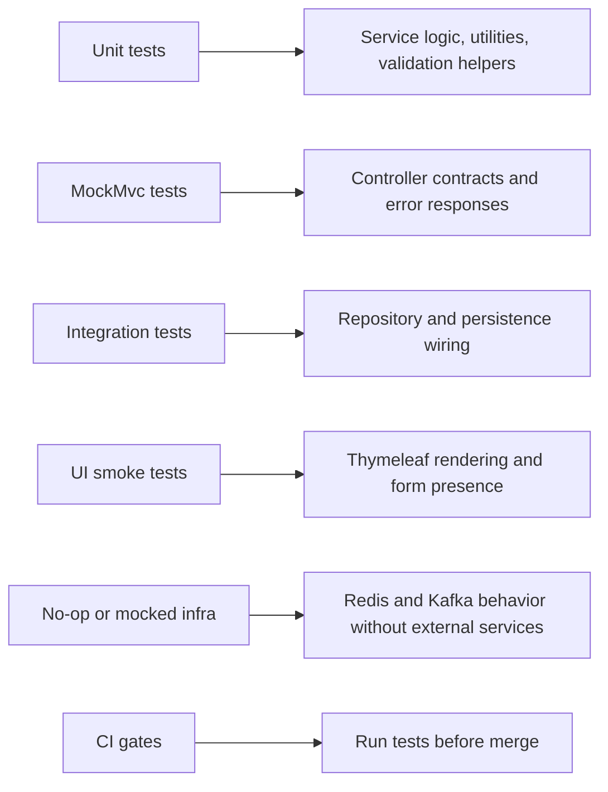
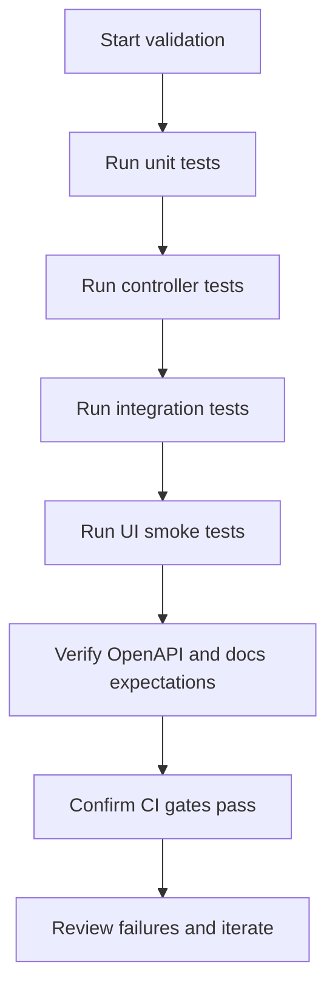

# Architecture, Execution, and Testing Guide

This document explains the repository layout, runtine architecture, control flow, and test strategy for the URL Shortener project. It also covers brownfield, greenfield, and ambiguous implementation enarios.

## Folder Structure

## Architecture Overview

## System Design And Key Decisions 

## Key decisions:
- Keep HTTP handling thin and push business rules into `UrlService`.
- Use repository-backed persistence with Postgres as the source of truth.
- Make Redis and Kafka optional so local development and tests remain runnable without external services.
- Keep UI and API on the same domain model and DTO boundary to reduce duplication.
- Centralize error translation in `ApiExceptionHandler` for consistent responses.

## Control Flow

## Sequence Diagrams By Scenario

### Brownfield Change

### Greenfield Change

### Ambiguous Change

# Testing Approach

## Recommended coverage layers:
- Unit tests for service logic, converters, and edge-case handling.
- MockMvc tests for request validation, response codes, and error shapes.
- Integration tests for persistence wiring and transactional behavior.
- VI smoke tests for dashboard, create, edit, and analytics templates.
- Mocks or no-op implementations for Redis and Kafka when full infrastructure is not needed.

## Limitations
- Redis and Kafka are modeled as optional dependencies, so no-op fallbacks can hide environment-specific problems until integration testing.
- UI tests validate rendering and key form fields, not pixel-perfect layout or browser-specific behavior.
- Sequence diagrams describe the intended execution path, not every exception branch or concurrent race.
- Testcontainers-based checks add runtime cost and require Docker in CI or Local development.
- The diagrams reflect the current repository shape and may need updates when package boundaries change.

## Validation Checklist

Validation should confirm:
- The code compiles and tests pass locally-
- API and UI behavior still matches the documented flow.
- Optional infrastructure can be disabled without breaking the core path.
- CI reproduces the same outcome with the same test matrix.

